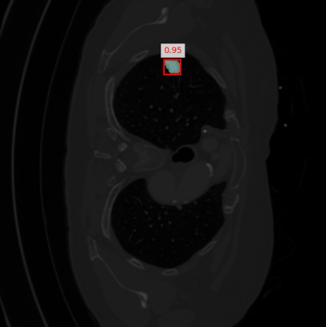
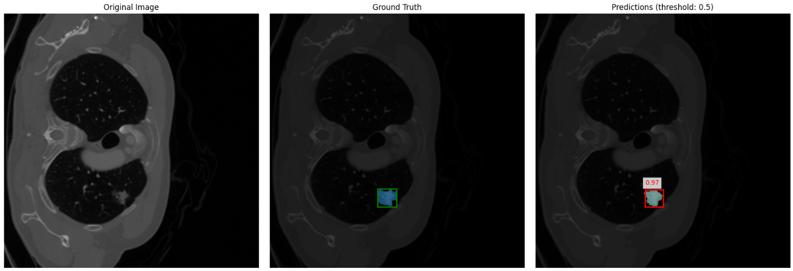

# Lung Tumor Detection and Segmentation using Mask R-CNN



This repository contains a PyTorch implementation of Mask R-CNN for detecting and segmenting lung tumors in medical images. The model is trained to both localize tumors with bounding boxes and provide pixel-level segmentation masks.

## Features

- Mask R-CNN implementation with ResNet-50 backbone
- Custom dataset loader for lung tumor images and annotations
- Training and evaluation scripts
- Visualization tools for model predictions
- Both instance-level and image-level evaluation metrics

## Repository Structure

```
lung-tumor-detection-and-segmentation/
├── datasets/
│   ├── __init__.py
│   └── lung_dataset.py          # Custom dataset class
├── models/
│   ├── __init__.py
│   └── Mask-Rcnn.py             # Mask R-CNN model implementation
├── playground/
│   ├── __pycache__/
│   └── playground.ipynb         # Jupyter notebook for experimentation
├── train/
│   ├── __init__.py
│   ├── predict_inference.py     # Inference script
│   └── train.py                 # Training script
├── .gitignore
├── README.md
├── requirements.txt             # Python dependencies
└── example_prediction.png       # Example output
```

## Requirements

- Python 3.7+
- PyTorch 1.8+
- torchvision
- albumentations
- opencv-python
- matplotlib
- numpy
- tqdm
- kagglehub (for dataset access)

## Installation

1. Install the required packages:
```bash
pip install -r requirements.txt
```

## Training the Model

To train the Mask R-CNN model:

```bash
python train/train.py
```

Training parameters can be adjusted in the `train.py` script:
- Batch size
- Number of epochs
- Learning rate
- Model save path

## Evaluation

To evaluate the trained model:

```bash
python train/predict_inference.py
```

The evaluation script will:
1. Load the trained model
2. Run inference on validation set
3. Calculate precision, recall, F1 score, and Dice score
4. Generate visualizations of predictions

## Inference on Single Images

To run inference on a single image:

```python
from train.predict_inference import visualize_single_image_prediction

model_path = "best_tumor_segmentation_model.pth"
image_path = "path/to/your/image.png"
visualize_single_image_prediction(model_path, image_path, score_threshold=0.3)
```

## Results

The model achieves the following performance metrics:

| Metric        | Value   |
|---------------|---------|
| Precision     | 0.83    |
| Recall        | 0.61    |
| F1 Score      | 0.70    |
| Dice Score    | 0.70    |

## Visualization Examples



## Acknowledgments

- The Mask R-CNN implementation is based on torchvision's implementation
- Dataset provided by [samamohamed29 on Kaggle](https://www.kaggle.com/datasets/samamohamed29/lungtumor)
```
